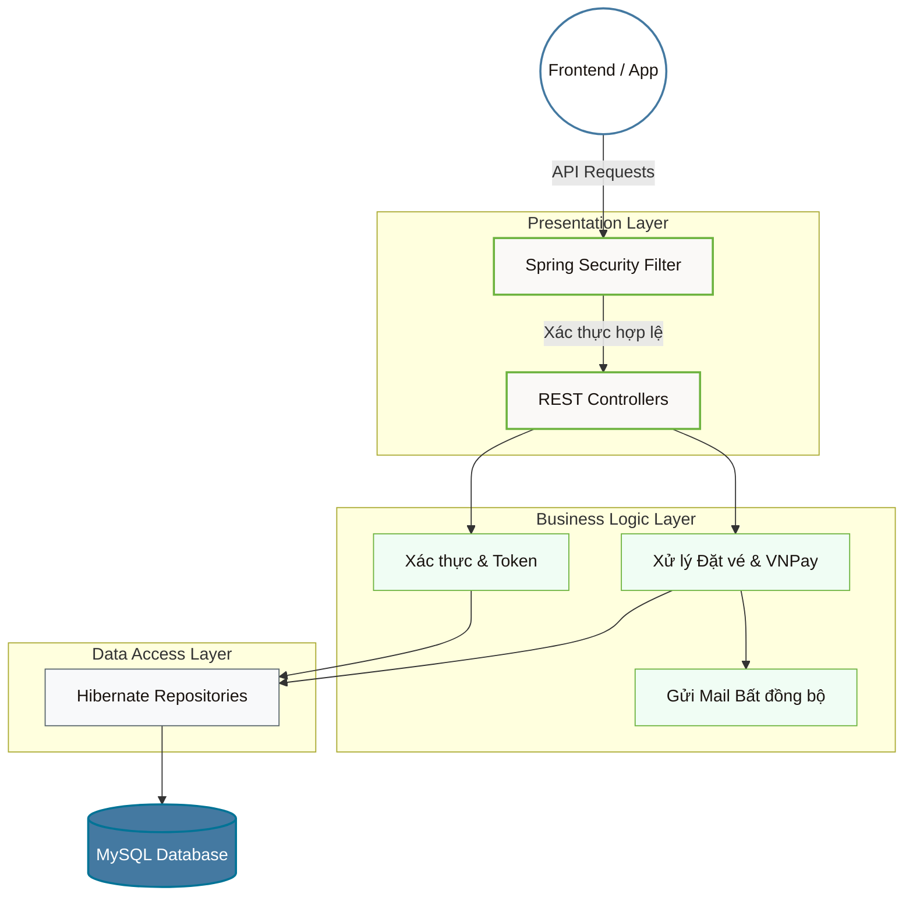

<div align="center">
  
  
  <h1 align="center" style="font-weight: 300; letter-spacing: 2px;">HỆ THỐNG QUẢN LÝ XE KHÁCH CAO CẤP</h1>
  <p align="center" style="font-size: 1.1em; color: #666; font-style: italic;">
    — PHÂN HỆ HỆ THỐNG MÁY CHỦ (BACKEND API SERVER) —
  </p>

  <p align="center" style="margin-top: 20px;">
    
    
    
    
  </p>
</div>

<br/>

## 1. TỔNG QUAN DỰ ÁN
Đây là kho lưu trữ mã nguồn Backend cho Đồ án **Hệ Thống Quản Lý Bến Xe Khách**. Hệ thống máy chủ được xây dựng trên nền tảng Java Spring, tuân thủ nghiêm ngặt các quy chuẩn thiết kế RESTful API, bảo mật đa lớp và tối ưu hóa truy vấn cơ sở dữ liệu để phục vụ cho các ứng dụng đa nền tảng (Web/Mobile).

---

## 2. CHI TIẾT CÁC TÍNH NĂNG & DỊCH VỤ CỐT LÕI (CORE SERVICES)

Backend là nơi xử lý toàn bộ nghiệp vụ logic phức tạp của hệ thống, bao gồm các module chính:

### 🛡️ Module Quản trị Định danh & Bảo mật (Auth & Security)
- **Cơ chế Token (Stateless JWT):** Sử dụng `Nimbus JOSE JWT` để mã hóa và giải mã phiên đăng nhập.
- **Phân quyền phân tầng (Role-Based Access Control):** 
  - Khởi tạo 5 cấp độ quyền (ADMIN, MANAGER, STAFF, DRIVER, PASSENGER).
  - Bảo vệ các Endpoints quan trọng thông qua Filters của Spring Security.

### 💰 Module Giao dịch & Cổng thanh toán (Payment Processing)
- **Tích hợp PayPal SDK:** Xử lý thanh toán quốc tế qua đồng USD, cung cấp API gọi trực tiếp đến PayPal Checkout và xử lý Callback.
- **Tích hợp VNPay API:** Sử dụng thuật toán `HmacSHA512` mã hóa chữ ký điện tử (Checksum) chống tấn công giả mạo dữ liệu thanh toán.

### 🚌 Module Nghiệp vụ Vận tải (Transport Logistics)
- Cung cấp toàn bộ các API (CRUD) để quản lý:
  - **Tuyến đường & Trạm trung chuyển:** Quản lý điểm đi, điểm đến và các trạm dừng chân.
  - **Xe khách & Đội xe:** Quản lý biển số, sơ đồ giường nằm/ghế ngồi.
  - **Chuyến xe (Trips):** Gán lịch trình, gán tài xế, quản lý số ghế trống realtime.
  - **Vé xe (Bookings):** Khởi tạo mã vé, tính toán giá tiền (bao gồm logic áp dụng Voucher giảm giá), ghi nhận thanh toán.

### 📧 Module Tự động hóa Dịch vụ (Automation & Cloud)
- **Tự động gửi Email (Auto-Mailer):** Cấu hình `Java Mail Sender` chạy trên luồng bất đồng bộ (Async Thread) để gửi **Vé Điện Tử (HTML Template)** ngay lập tức sau khi có Callback thanh toán thành công.
- **Lưu trữ Đám mây (Cloud Storage):** API upload trực tiếp hình ảnh (Avatar, Xe) lên máy chủ **Cloudinary CDN**, giảm tải lưu trữ cho database.

### 📊 Module Phân tích Dữ liệu (Data Analytics)
- Thực thi các câu lệnh **HQL (Hibernate Query Language)** phức tạp nhằm kết xuất dữ liệu thống kê:
  - Tính tổng doanh thu theo tháng/năm.
  - Thống kê tỷ lệ loại vé và tỷ lệ người dùng hệ thống.
  - Trả về JSON phục vụ chức năng xuất báo cáo CSV cho Frontend.

---

## 3. KIẾN TRÚC MÁY CHỦ (SYSTEM ARCHITECTURE)



---

## 4. HƯỚNG DẪN TRIỂN KHAI

### Yêu cầu cấu hình
- **Java 17 (JDK)**
- **Apache Maven 3.8+**
- **MySQL 8.0+**

### Các bước cài đặt

**1. Clone mã nguồn:**
```bash
git clone https://github.com/Tranloc12/DoAnNganhQuanLiXeKhach.git
```

**2. Thiết lập Môi trường (Cơ sở dữ liệu & Email):**
Bạn cần thay đổi thông tin kết nối DB và Email SMTP trong các file cấu hình tại thư mục `src/main/resources/`:
```properties
# Trong application.properties / HibernateConfigs.java
jdbc.url=jdbc:mysql://[HOST]:3306/carmanagementdb
jdbc.username=your_username
jdbc.password=your_password

# Trong mail.properties
mail.username=tài-khoản-gmail-của-bạn@gmail.com
mail.password=mã-app-password-của-gmail
```

**3. Khởi chạy Ứng dụng:**
Sử dụng IDE (IntelliJ IDEA/Eclipse) để cấu hình **Tomcat Server** và build artifact `CarManagementApp:war`.
Hoặc chạy lệnh Maven qua terminal:
```bash
mvn clean install
```
Server mặc định sẽ chạy ở port `8080`.

<br/>
<div align="center">
  <hr style="width: 50%; border: 1px solid #eaeaea;" />
  <p style="color: #888; font-size: 0.9em; margin-top: 20px;">
    <i>Kiến trúc vững chắc, Bảo mật tuyệt đối.</i>
  </p>
</div>
