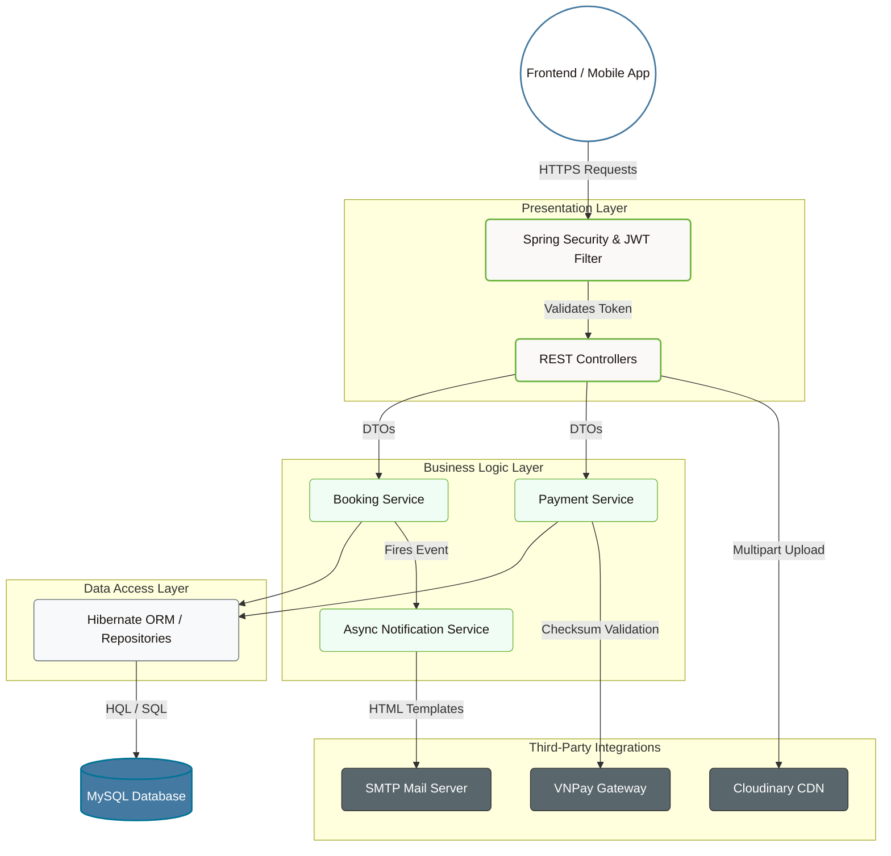

<div align="center">
  
  
  <h1 align="center" style="font-weight: 300; letter-spacing: 2px;">TRANSPORTATION MANAGEMENT SYSTEM</h1>
  <p align="center" style="font-size: 1.1em; color: #666; font-style: italic;">
    — BACKEND API & DATA SERVICES —
  </p>

  <p align="center" style="margin-top: 20px;">
    
    
    
    
  </p>
</div>

<br/>

## 1. PROJECT OVERVIEW
This repository contains the backend infrastructure for the Transportation Management System. Engineered using an N-Tier architecture, it provides a highly secure, scalable, and resilient RESTful API layer that orchestrates complex business logic, transactional integrity, and third-party integrations.

## 2. SYSTEM ARCHITECTURE

The backend is structured to isolate business logic from data access and presentation layers, ensuring modularity and ease of testing.



## 3. CORE CAPABILITIES

### Identity & Access Management (IAM)
*   **Stateless Authentication**: Implemented via JSON Web Tokens (JWT) adhering to the Nimbus JOSE standard.
*   **Granular Role-Based Access Control (RBAC)**: Enforced endpoint security across multiple roles (`ADMIN`, `MANAGER`, `STAFF`, `DRIVER`, `PASSENGER`).

### Transaction & Payment Processing
*   **Secure Payment Integrations**: Native SDK integration for PayPal and cryptographic signature (HmacSHA512) validation for VNPay transactions, guaranteeing financial data integrity.

### Asynchronous Operations
*   **Automated Email Dispatch**: Utilizes Java Mail Sender operating on dedicated background threads to instantly deliver HTML-formatted digital tickets upon successful payment verification without blocking the main request thread.

### Advanced Analytics Engine
*   **Complex Aggregation**: Optimized Hibernate Query Language (HQL) executions to aggregate monthly revenue, passenger demographics, and route popularities for executive dashboard rendering.

## 4. DIRECTORY STRUCTURE

```text
src/main/java/com/nhom12/
├── configs/              # Framework configurations (Security, Mail, DB)
├── controllers/          # RESTful API Endpoints
├── dto/                  # Data Transfer Objects for Request/Response mapping
├── pojo/                 # Plain Old Java Objects (Hibernate Entities)
├── repositories/         # Data Access Objects interface and implementation
├── services/             # Core business logic implementation
└── utils/                # Cryptography, JWT generation, and generic helpers
```

## 5. DEPLOYMENT GUIDE

### Prerequisites
*   Java Development Kit (JDK) 17
*   Apache Maven 3.8+
*   MySQL 8.0+ Server

### Configuration Steps
1. **Database Setup**: Modify database credentials in `src/main/resources/application.properties` or your specific configuration class (`HibernateConfigs.java`).
   ```properties
   jdbc.driver=com.mysql.cj.jdbc.Driver
   jdbc.url=jdbc:mysql://[HOST]:3306/carmanagementdb
   jdbc.username=your_username
   jdbc.password=your_password
   ```

2. **SMTP Setup (For Automated Ticketing)**: Update your mail properties. Note: Use an App Password if utilizing Gmail.
   ```properties
   mail.host=smtp.gmail.com
   mail.port=587
   mail.username=your_email@gmail.com
   mail.password=your_app_password
   ```

3. **Build & Execute**:
   ```bash
   # Clean and build the artifact
   mvn clean install
   ```
   Deploy the resulting `CarManagementApp:war` artifact to an application server such as Apache Tomcat. The default port is `8080`.

<br/>
<div align="center">
  <hr style="width: 50%; border: 1px solid #eaeaea;" />
  <p style="color: #888; font-size: 0.9em; margin-top: 20px;">
    <i>Architected for Scalability, Designed for Excellence.</i>
  </p>
</div>
