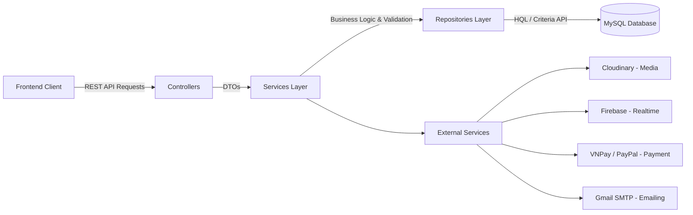

<div align="center">
  
  
  <h1 style="color: #6DB33F; font-family: 'Playfair Display', serif;">LUXURY BUS MANAGEMENT SYSTEM</h1>
  <p><b>PHÂN HỆ HỆ THỐNG MÁY CHỦ (BACKEND API SERVER)</b></p>
  
  <p>
    <i>Kiến trúc máy chủ mạnh mẽ, bảo mật đa tầng, cung cấp dữ liệu Real-time và khả năng mở rộng (Scalability) cao.</i>
  </p>

  <p>
    <a href="#technologies"></a>
    <a href="#technologies"></a>
    <a href="#technologies"></a>
    <a href="#technologies"></a>
  </p>
</div>

<hr />

## 📖 GIỚI THIỆU TỔNG QUAN

**Backend API Server** của hệ thống Luxury Bus Management là xương sống xử lý toàn bộ nghiệp vụ phức tạp của nền tảng đặt vé xe cao cấp. Được thiết kế theo chuẩn kiến trúc **N-Tier Architecture** kết hợp nguyên lý RESTful, hệ thống đảm bảo tính toàn vẹn dữ liệu, hiệu suất cao và bảo mật nghiêm ngặt.

---

## ✨ KIẾN TRÚC & NGHIỆP VỤ CỐT LÕI (CORE FEATURES)

### 🛡️ Hệ thống Bảo mật (Security & IAM)
- **Spring Security & JWT:** Xác thực Token (Stateless Authentication) qua chuẩn `Nimbus JOSE JWT`.
- **Role-based Access Control (RBAC):** Phân quyền chặt chẽ các cấp độ truy cập (ADMIN, MANAGER, STAFF, DRIVER, PASSENGER). Mọi API nhạy cảm đều được chặn quyền ngay từ Router.

### 💰 Cổng thanh toán & Giao dịch (Payment Gateways)
- **Tích hợp PayPal SDK:** Tạo và thực thi luồng thanh toán quốc tế, trả về Callback URL thông minh.
- **Tích hợp VNPay API:** Mã hóa thuật toán HmacSHA512 để sinh mã giao dịch an toàn (Checksum), đảm bảo tính toàn vẹn dòng tiền.

### 📧 Tự động hóa Dịch vụ (Automation Workflows)
- **Email Thông báo (Java Mail Sender):** Xử lý gửi email xác nhận đặt vé (chứa HTML Template Vé điện tử) tự động trên một Thread độc lập (Asynchronous) để không làm gián đoạn luồng đặt vé của User.
- **Cập nhật Vị trí (Location Tracking):** API tiếp nhận tọa độ GPS từ thiết bị tài xế và phục vụ truy vấn Real-time cho khách hàng.

### 📊 Phân tích & Trích xuất (Analytics Engine)
- Truy vấn phức tạp bằng **HQL (Hibernate Query Language)**.
- Trả về cấu trúc dữ liệu JSON để phục vụ việc vẽ biểu đồ doanh thu tháng, số chuyến đi và lưu lượng người dùng cho trang Admin Dashboard.

---

## 🏗️ CẤU TRÚC HỆ THỐNG (SYSTEM ARCHITECTURE)



### Phân rã cấu trúc thư mục
```text
src/main/java/com/nhom12/
├── configs/          # Cấu hình Spring Context, Database, Security, Mail
├── controllers/      # Điểm tiếp nhận API (REST Controllers)
├── dto/              # Data Transfer Objects (Request/Response Models)
├── pojo/             # Các Entity ánh xạ Database (Hibernate Mappings)
├── repositories/     # Data Access Layer (Truy vấn DB trực tiếp)
├── services/         # Business Logic Layer (Xử lý logic, gọi các repo)
└── utils/            # Các hàm hỗ trợ (Format, Token generator, Validation)
```

---

## 🚀 HƯỚNG DẪN CÀI ĐẶT & TRIỂN KHAI

### 1. Yêu cầu Môi trường
- **JDK 17**
- **Apache Maven 3.8+**
- **MySQL 8.0+**
- **Tomcat 10.x** (Môi trường Web Server)

### 2. Cấu hình Cơ Sở Dữ Liệu
Mở file cấu hình Database (`src/main/java/com/nhom12/configs/HibernateConfigs.java` hoặc file `properties` nếu có) và cập nhật thông số kết nối:
```properties
jdbc.driver=com.mysql.cj.jdbc.Driver
jdbc.url=jdbc:mysql://[HOST]:3306/carmanagementdb
jdbc.username=your_username
jdbc.password=your_password
```

### 3. Cấu hình SMTP Email (Auto-Mailer)
Để tính năng gửi vé tự động qua Email hoạt động, hãy mở `src/main/resources/mail.properties` và thiết lập:
```properties
mail.host=smtp.gmail.com
mail.port=587
mail.username=tài-khoản-gmail-của-bạn@gmail.com
mail.password=app-password-của-gmail
```

### 4. Khởi chạy Server
1. Clone dự án về máy: `git clone https://github.com/Tranloc12/DoAnNganhQuanLiXeKhach.git`
2. Mở dự án bằng **IntelliJ IDEA** hoặc **Eclipse**.
3. Cài đặt các Dependencies bằng Maven: `mvn clean install`
4. Setup Tomcat Server trong IDE, trỏ artifact vào `CarManagementApp:war`.
5. Bấm **Run**. Hệ thống Backend sẽ lắng nghe các request tại `http://localhost:8080/CarManagementApp`.

---

<div align="center">
  <p><i>Made with ❤️ by Nhóm Phát Triển - Đồ Án Chuyên Ngành CNTT</i></p>
</div>
